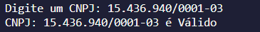
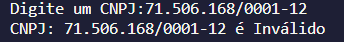
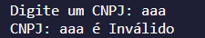

# Validação de CNPJ

## 📌SOBRE
Realiza a verificação do CNPJ especificado e informa se é valido ou inválido com base no cálculo de criação do mesmo.

&nbsp;
### 🔄ULTILIZAÇÃO

Informe um cnpj:

&nbsp;

Saída:

&nbsp;

Entrada não numérica:

